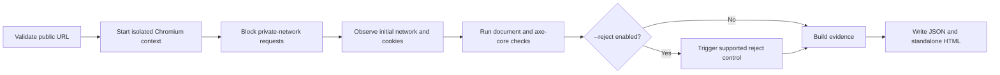

# Web Evidence

[](https://github.com/Monk69Ozu/web-evidence/actions/workflows/ci.yml)
[](LICENSE)

**Evidence-first, self-hosted web diagnostics.** Web Evidence observes what a website actually does during a clean browser session and produces a reproducible JSON record plus a standalone HTML report.

It focuses on technical signals that are useful during privacy, consent, accessibility, and quality reviews. It deliberately does **not** claim that a website is compliant or non-compliant.

## Why this exists

Many website scanners return an unexplained score. Web Evidence keeps the underlying technical observations visible:

- which catalogued tracker endpoints were requested on the untouched initial load;
- which cookie names and attributes existed, without storing cookie values;
- whether a consent surface and a supported reject control were detectable;
- what changed after an explicitly enabled reject action;
- which WCAG rules axe-core reported and which selectors were affected;
- whether basic document signals such as language, labels, alt attributes, and policy links were present.

The output is designed for engineers, auditors, agencies, maintainers, and researchers who need evidence they can inspect instead of a black-box verdict.

## Safety and privacy defaults

| Default | Behaviour |
| --- | --- |
| Read-only | Consent controls are observed but never activated unless `--reject` is supplied. |
| Never accepts consent | The optional interaction only searches for supported reject labels. |
| No response bodies | HTML, API responses, and uploaded content are not retained. |
| No cookie values | Only name, domain, path, and security attributes are recorded. |
| No query strings | URL queries are removed unless `--include-query` is explicitly supplied. |
| SSRF guard | Initial navigation, redirects, and subresources resolving to private or reserved IP space are blocked. |
| No legal verdicts | Every generated finding has `legalConclusion: false`. |

See [Data Policy](docs/DATA_POLICY.md) and [Threat Model](docs/THREAT_MODEL.md) for the full boundaries.

## Quick start

Requirements: Node.js 20.11 or newer.

```bash
git clone https://github.com/Monk69Ozu/web-evidence.git
cd web-evidence
npm install
npx playwright install chromium
npm run build
node lib/cli.js https://example.com
```

The scan writes:

```text
web-evidence-report/
├── report.json   # stable machine-readable evidence
└── report.html   # standalone human-readable report
```

### Observe a page without interacting

```bash
npm run scan -- https://example.com --output ./reports/example
```

### Compare the state after rejecting consent

```bash
npm run scan -- https://example.com --reject --output ./reports/example-reject
```

`--reject` is opt-in. It clicks only a visible control matching a conservative multilingual reject-label list. It never clicks an accept control.

### Create a shareable redacted report

```bash
npm run scan -- https://example.com --redact-host --output ./reports/redacted
```

## CLI reference

```text
Usage: web-evidence [options] <url>

Arguments:
  url                       Public http(s) URL to scan

Options:
  -o, --output <directory>  Output directory
  --reject                  Trigger a supported visible reject control
  --include-query           Retain query strings in network evidence
  --redact-host             Hash all hostnames in stored evidence
  --headed                  Show the Chromium window
  --timeout <milliseconds>  Navigation timeout
  --settle <milliseconds>   Wait after load and consent actions
```

## What a scan does



The scanner uses a fresh browser context with service workers blocked. It does not reuse cookies, local storage, or an authenticated browser profile.

## Evidence model

The versioned schema is available at [`schema/web-evidence-report.schema.json`](schema/web-evidence-report.schema.json). A synthetic example is included at [`examples/sample-report.json`](examples/sample-report.json).

Important evidence phases:

- `initial`: recorded before any consent interaction;
- `after_reject`: recorded only after an explicitly requested reject action.

Network entries include the sanitized URL, host, method, resource type, first-/third-party signal, phase, and an optional transparent tracker-catalog match. They do not include request or response bodies.

## Architecture

```text
src/
├── analysis/       consent, document, tracker, and axe-core analysis
├── report/         deterministic standalone HTML rendering
├── security/       URL validation and private-network blocking
├── scanner.ts      isolated browser orchestration and evidence capture
├── findings.ts     technical observations without legal conclusions
└── cli.ts          command-line interface
```

See [Architecture](docs/ARCHITECTURE.md) for trust boundaries and extension points.

## Known limitations

- Consent interfaces are highly variable. Banner and reject-control detection can miss custom implementations.
- A tracker catalog is evidence of a matched endpoint, not proof of the endpoint's purpose on a specific site.
- Automated accessibility testing finds only a subset of accessibility problems and requires manual review.
- The current scanner evaluates one page per command. Crawl support is intentionally deferred until scope and rate controls are mature.
- Some sites block automated browsers or render different content based on geography.
- A clean report is not a compliance certification.

## Responsible use

Scan only systems you are authorized to assess. Keep scan rates low, follow applicable terms and laws, and do not use the tool to collect personal data. The project is intended for defensive review, maintenance, and transparent technical research.

## Development

```bash
npm install
npm run check
```

The check pipeline performs strict TypeScript validation, 24 deterministic tests, and a production build. Browser installation is only required for live scans.

Contributions are welcome. Start with [CONTRIBUTING.md](CONTRIBUTING.md), and use GitHub's private vulnerability reporting for security issues.

## License

Apache License 2.0. See [LICENSE](LICENSE).
